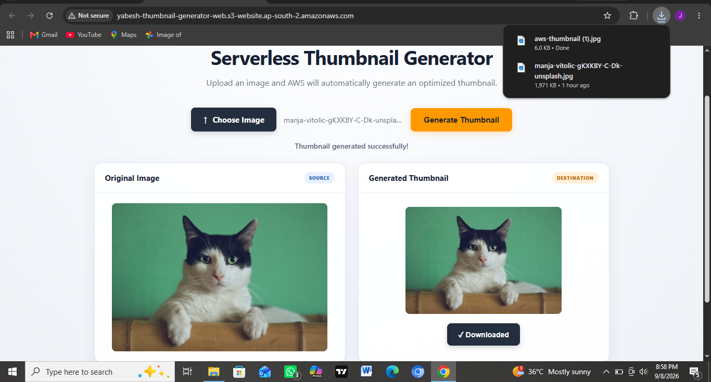

# AWS Serverless Image Thumbnail Generator

A complete **serverless image-processing web application built on AWS**.

Users can select an image directly from the browser, upload it securely to Amazon S3, and automatically generate an optimized thumbnail using **AWS Lambda, Python, and Pillow**.

The generated thumbnail is automatically displayed back on the website and can be downloaded directly from the browser.

This project demonstrates an end-to-end serverless workflow using **Amazon S3, Amazon API Gateway, AWS Lambda, IAM, CloudWatch, Python, Pillow, HTML, CSS, and JavaScript**.

---

## Live Application

The completed web application allows users to:

- Choose an image from their device
- Preview the original image
- Upload the image securely to Amazon S3
- Automatically trigger serverless image processing
- Generate a thumbnail with a maximum size of **300×300 pixels**
- Preserve the original image aspect ratio
- Display the generated thumbnail on the same webpage
- Download the generated thumbnail directly from the browser

### Working Web Application



### Generated Thumbnail

Below is an actual thumbnail generated and downloaded through the application:


---

## Application Workflow

```text
User / Browser
      │
      ▼
S3 Static Website
HTML + CSS + JavaScript
      │
      ▼
Amazon API Gateway
      │
      ▼
Upload API Lambda
      │
      │ Generate Presigned URL
      ▼
Browser
      │
      │ Upload Image
      ▼
Source S3 Bucket
      │
      │ s3:ObjectCreated Event
      ▼
Thumbnail Processor Lambda
Python + Pillow
      │
      ├──────────────► CloudWatch Logs
      │
      ▼
Destination S3 Bucket
      │
      ▼
Generated Thumbnail
      │
      ▼
Browser Preview
      │
      ▼
Download
```

---

## Features

- Serverless image-processing architecture
- Browser-based image upload
- Static website hosted using Amazon S3
- Amazon API Gateway HTTP API
- Secure S3 uploads using presigned URLs
- Event-driven Lambda invocation using S3 events
- Automatic image resizing using Python and Pillow
- Maximum thumbnail size of **300×300 pixels**
- Original aspect ratio preserved
- Separate S3 buckets for original images and generated thumbnails
- Automatic thumbnail detection from the frontend
- Generated thumbnail displayed without manually refreshing the page
- Browser-based thumbnail download
- IAM-based access control
- Amazon CloudWatch logging and monitoring
- Responsive HTML/CSS/JavaScript frontend
- No EC2 instances or traditional web servers required

---

## Architecture


### Architecture Flow

```text
                     USER / BROWSER
                           │
                           ▼
                    S3 Static Website
                    HTML + CSS + JS
                           │
                           ▼
                    Amazon API Gateway
                           │
                           ▼
                     Upload API Lambda
                           │
                    Presigned S3 URL
                           │
                           ▼
                     Source S3 Bucket
                           │
                    ObjectCreated Event
                           │
                           ▼
                  Thumbnail Processor
                       AWS Lambda
                    Python + Pillow
                           │
                ┌──────────┴──────────┐
                │                     │
                ▼                     ▼
         Destination S3        CloudWatch Logs
        thumbnails/*.jpg
                │
                ▼
          API Gateway / Lambda
                │
                ▼
        Browser Thumbnail Preview
                │
                ▼
             Download
```

---

# How It Works

## 1. Static Web Application

The frontend is built using:

- HTML
- CSS
- JavaScript

The website is hosted using **Amazon S3 Static Website Hosting**.

Users select an image through the browser and can immediately preview the original image before uploading it.

```text
Browser
   │
   ▼
S3 Static Website
   │
   ├── index.html
   ├── style.css
   └── script.js
```

---

## 2. API Gateway

The frontend communicates with the backend through an **Amazon API Gateway HTTP API**.

API Gateway provides the public API endpoint used by the JavaScript frontend.


The API connects the browser application to the serverless Lambda backend without requiring a traditional application server.

---

## 3. Upload API Lambda

A dedicated AWS Lambda function handles requests from the frontend.


The function generates temporary **Amazon S3 presigned URLs**.

This allows the browser to upload the selected image directly to the private source S3 bucket without exposing AWS credentials in the frontend.

```text
Browser
   │
   │ Request Upload URL
   ▼
API Gateway
   │
   ▼
Upload API Lambda
   │
   │ Generate Presigned URL
   ▼
Browser
   │
   │ PUT Image
   ▼
Source S3 Bucket
```

This separates the frontend from direct AWS authentication while still allowing controlled access to S3.

---

## 4. Source S3 Bucket

The original image is uploaded to the source Amazon S3 bucket.

When a new object is created, Amazon S3 generates an event:

```text
s3:ObjectCreated:*
```

This event automatically invokes the thumbnail-processing Lambda function.

```text
Image Upload
     │
     ▼
Source S3
     │
     │ ObjectCreated
     ▼
AWS Lambda
```

No server or continuously running worker is required.

---

## 5. Thumbnail Processing Lambda

The image-processing Lambda retrieves the uploaded image from Amazon S3 and processes it using **Python and Pillow**.

The function:

- Reads the S3 event
- Extracts the source bucket and object key
- Downloads the uploaded image using `s3:GetObject`
- Loads the image into memory
- Resizes the image using Pillow
- Preserves the original aspect ratio
- Restricts the thumbnail to a maximum of **300×300 pixels**
- Converts the processed image to JPEG
- Uploads the generated thumbnail to the destination S3 bucket

The core resizing operation uses:

```python
image.thumbnail((300, 300))
```

Pillow's `thumbnail()` method preserves the original aspect ratio while ensuring neither dimension exceeds 300 pixels.

---

## Generated Thumbnail Structure

Generated thumbnails are stored under the:

```text
thumbnails/
```

prefix.

Generated object format:

```text
thumbnails/<filename>-thumbnail.jpg
```

Example:

```text
Destination S3 Bucket
│
└── thumbnails/
    ├── image1-thumbnail.jpg
    ├── image2-thumbnail.jpg
    └── image3-thumbnail.jpg
```

---

## Automatic Thumbnail Display

The image-processing workflow is asynchronous.

After the original image is uploaded, the frontend waits for AWS Lambda to complete processing.

```text
Upload Original
      │
      ▼
Source S3
      │
      ▼
S3 Event
      │
      ▼
Lambda Processing
      │
      ▼
Thumbnail Created
      │
      ▼
Frontend Detects Result
      │
      ▼
Thumbnail Displayed
```

Once the thumbnail becomes available, it is automatically displayed inside the **Generated Thumbnail** section of the application.

The user does not need to manually open the destination S3 bucket or refresh the webpage.

---

## Thumbnail Download

After processing is complete, the generated thumbnail appears inside the web application.

### Browser Result


The user can download the generated thumbnail directly from the browser.

### Actual Downloaded Thumbnail

Below is an actual generated thumbnail downloaded through the application:


This completes the full workflow:

```text
Upload → Process → Preview → Download
```

---

## Tech Stack

| Component | Technology / AWS Service |
|---|---|
| Frontend | HTML, CSS, JavaScript |
| Website Hosting | Amazon S3 Static Website Hosting |
| API Layer | Amazon API Gateway HTTP API |
| Upload Backend | AWS Lambda |
| Image Processing | AWS Lambda |
| Programming Language | Python |
| Image Processing Library | Pillow |
| Object Storage | Amazon S3 |
| Secure Upload | S3 Presigned URLs |
| Event Trigger | S3 Event Notifications |
| Access Control | AWS IAM |
| Monitoring & Logging | Amazon CloudWatch |
| Architecture | Serverless / Event-Driven |
| Website Region | ap-south-2 (Hyderabad) |
| Image Processing S3 Resources | us-east-1 (N. Virginia) |

---

## Project Structure

```text
aws-serverless-thumbnail-generator/
│
├── frontend/
│   ├── index.html
│   ├── style.css
│   └── script.js
│
├── lambda/
│   ├── upload_api/
│   │   └── lambda_function.py
│   │
│   └── thumbnail_processor/
│       └── lambda_function.py
│
├── screenshots/
│   ├── web-application.png
│   ├── aws-thumbnail.jpg
│   ├── architecture-diagram.png
│   ├── api-gateway.png
│   ├── upload-api-lambda.png
│   ├── s3-event-trigger-config.png
│   ├── lambda-function-code.png
│   ├── cloudwatch-logs.png
│   ├── iam-role-permissions.png
│   └── before-after-thumbnail.png
│
├── lambda_function.py
├── requirements.txt
├── .gitignore
└── README.md
```

---

# Frontend

The frontend is stored inside:

```text
frontend/
```

and contains:

```text
index.html
style.css
script.js
```

### index.html

Defines the user interface including:

- Image selection
- Original image preview
- Generate Thumbnail button
- Generated thumbnail preview
- Download functionality
- Architecture workflow display

### style.css

Provides the responsive styling for the application across desktop and mobile devices.

### script.js

Handles the browser-side workflow including:

- Reading the selected image
- Displaying the original image preview
- Calling API Gateway
- Requesting a presigned upload URL
- Uploading the image to Amazon S3
- Checking for the generated thumbnail
- Displaying the processed thumbnail
- Downloading the generated image

---

# Lambda Functions

The application uses two Lambda responsibilities.

## Upload API Lambda

Location:

```text
lambda/upload_api/lambda_function.py
```

Responsibilities:

- Receive requests from API Gateway
- Generate unique S3 object keys
- Generate presigned upload URLs
- Return upload information to the frontend
- Check whether generated thumbnails are available
- Provide temporary access to generated results

---

## Thumbnail Processor Lambda

Location:

```text
lambda/thumbnail_processor/lambda_function.py
```

Responsibilities:

- Receive S3 `ObjectCreated` events
- Retrieve uploaded images
- Process images using Python and Pillow
- Resize images while preserving aspect ratio
- Generate JPEG thumbnails
- Store processed images in the destination S3 bucket

---

# S3 Event-Driven Processing

The source S3 bucket is configured to invoke the thumbnail Lambda automatically whenever a new object is uploaded.


The event-driven architecture removes the need for:

- Dedicated application servers
- Continuously running image-processing workers
- Manual Lambda invocation

Amazon S3 acts as the event source and AWS Lambda performs image processing on demand.

---

# Lambda Processing Code

The thumbnail-generation function is implemented using Python.


The function processes images in memory using Python `BytesIO`.

The destination bucket can be supplied to the Lambda function through the environment variable:

```text
DESTINATION_BUCKET
```

This separates environment-specific configuration from the application logic.

---

# IAM Permissions

IAM roles provide the Lambda functions with the permissions required to interact with AWS services.


Required actions include operations such as:

```text
s3:GetObject
s3:PutObject
logs:CreateLogGroup
logs:CreateLogStream
logs:PutLogEvents
```

The upload API Lambda requires appropriate S3 permissions for the operations performed through its presigned URLs.

The thumbnail processor requires permission to read original images and write generated thumbnails.

IAM permissions should follow the **principle of least privilege** and be scoped only to the required AWS resources and actions.

---

# CloudWatch Monitoring

AWS Lambda integrates with Amazon CloudWatch for execution logging and monitoring.


CloudWatch was used to:

- Verify Lambda invocations
- Confirm successful execution
- Inspect processing errors
- Troubleshoot S3 and Lambda integration
- Monitor the event-driven workflow

---

# Original vs Generated Thumbnail

The image-processing result can also be verified by comparing the original image with the generated output.


The generated thumbnail remains proportional to the original image because the processing logic preserves its aspect ratio.

---

# Deployment Process

The project was implemented through the following process:

1. Created separate Amazon S3 buckets for original images and generated thumbnails.
2. Created the image-processing AWS Lambda function.
3. Added Pillow support to the Lambda environment.
4. Configured the destination S3 bucket.
5. Added the required IAM permissions.
6. Configured the S3 `ObjectCreated` event notification.
7. Connected the source S3 bucket to the thumbnail processor Lambda.
8. Tested automatic thumbnail generation using direct S3 uploads.
9. Created a separate S3 bucket for the static website.
10. Enabled Amazon S3 Static Website Hosting.
11. Developed the HTML, CSS, and JavaScript frontend.
12. Created the upload API Lambda.
13. Created an Amazon API Gateway HTTP API.
14. Connected API Gateway to Lambda.
15. Connected the frontend to API Gateway.
16. Implemented S3 presigned uploads.
17. Configured S3 and API CORS settings.
18. Implemented automatic checking for generated thumbnails.
19. Added original image preview functionality.
20. Added generated thumbnail preview functionality.
21. Added browser-based thumbnail download functionality.
22. Tested the complete browser-to-AWS workflow.

---

# Security Design

AWS credentials are **not stored inside the frontend JavaScript**.

Instead, the browser requests temporary presigned URLs from the serverless backend.

```text
Browser
   │
   ▼
API Gateway
   │
   ▼
AWS Lambda
   │
   ▼
Temporary Presigned URL
   │
   ▼
Direct S3 Operation
```

This allows the web application to interact with private S3 image-storage buckets without exposing permanent AWS access keys.

Security practices demonstrated include:

- IAM execution roles
- Least-privilege permissions
- Private source image bucket
- Private destination thumbnail bucket
- S3 CORS configuration
- API Gateway CORS configuration
- Temporary presigned URLs
- No AWS credentials stored in frontend code
- Separation between website hosting and image-storage buckets

---

# Why Serverless?

The application does not require EC2 instances or a continuously running application server.

The architecture primarily uses managed AWS services:

```text
Amazon S3
Amazon API Gateway
AWS Lambda
Amazon CloudWatch
AWS IAM
```

Lambda executes only when required, while Amazon S3 provides object storage and static website hosting.

This results in a lightweight, event-driven serverless architecture.

---

# What I Learned

Through this project, I gained hands-on experience with:

- Building an end-to-end serverless application on AWS
- Designing event-driven architectures
- Integrating Amazon S3 with AWS Lambda
- Building HTTP APIs using Amazon API Gateway
- Connecting a JavaScript frontend to AWS services
- Generating and using Amazon S3 presigned URLs
- Configuring Amazon S3 CORS
- Configuring API Gateway CORS
- Hosting static websites using Amazon S3
- Processing images using Python and Pillow
- Working with Lambda Layers and external dependencies
- Managing Lambda environment configuration
- Creating IAM permissions for service-to-service communication
- Applying least-privilege IAM principles
- Using CloudWatch Logs for troubleshooting
- Handling asynchronous serverless workflows
- Working with S3 object keys and event payloads
- Building browser-based upload and download functionality
- Debugging API Gateway, Lambda, S3, and browser integrations

---

# Key AWS Concepts Demonstrated

`Amazon S3` • `AWS Lambda` • `Amazon API Gateway` • `AWS IAM` • `Amazon CloudWatch` • `S3 Presigned URLs` • `S3 Static Website Hosting` • `S3 Event Notifications` • `Lambda Layers` • `CORS` • `Event-Driven Architecture` • `Serverless Computing`

---

# Project Result

The final application provides a complete serverless workflow:

```text
User
 ↓
Web Application
 ↓
API Gateway
 ↓
Upload Lambda
 ↓
Presigned S3 Upload
 ↓
Source S3
 ↓
S3 ObjectCreated Event
 ↓
Thumbnail Processor Lambda
 ↓
Destination S3
 ↓
Generated Thumbnail
 ↓
Browser Preview
 ↓
Download
```

The project started as a simple **S3-triggered Lambda image processor** and was extended into a functional browser-based serverless application.

It demonstrates both the underlying AWS infrastructure and a working user-facing application built entirely around managed AWS services.
