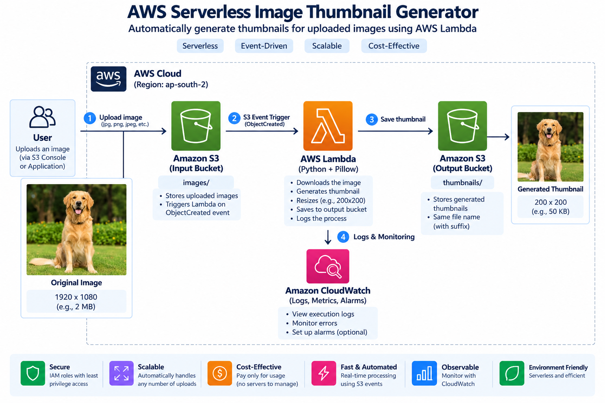
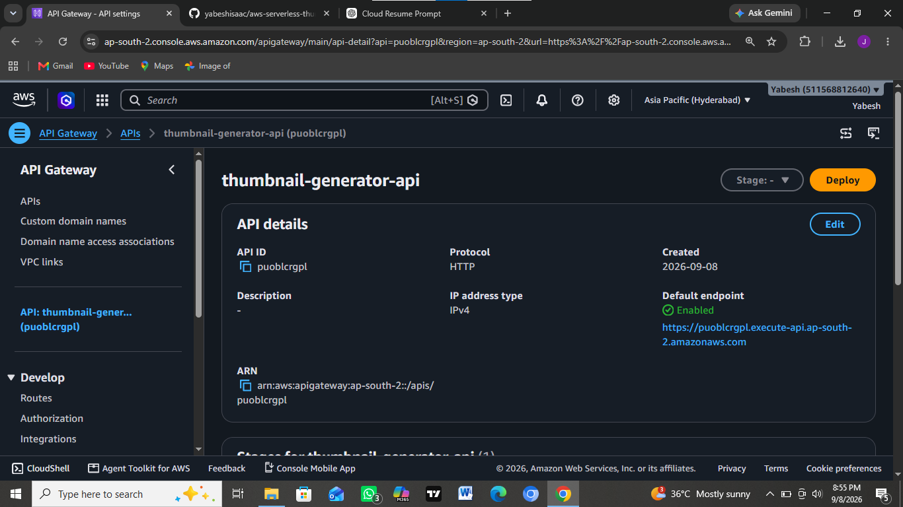
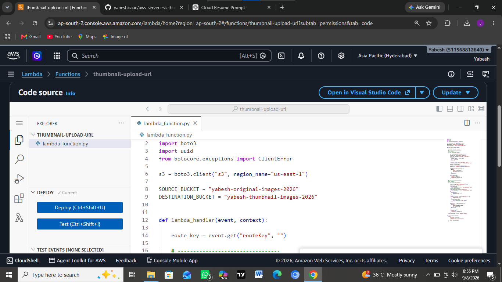
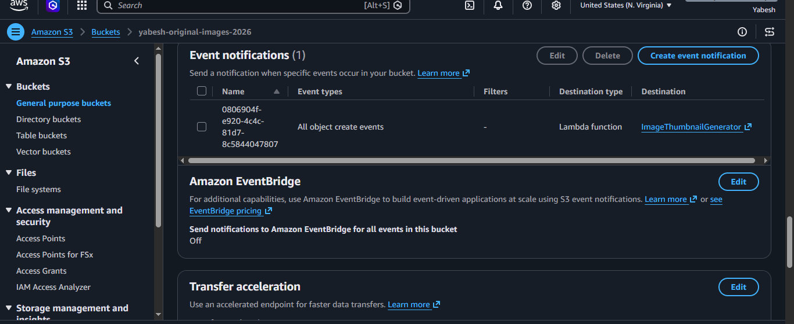
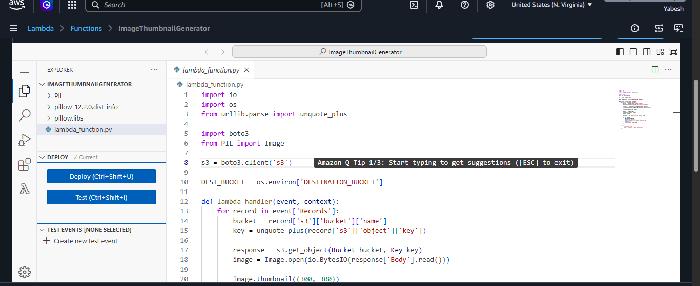
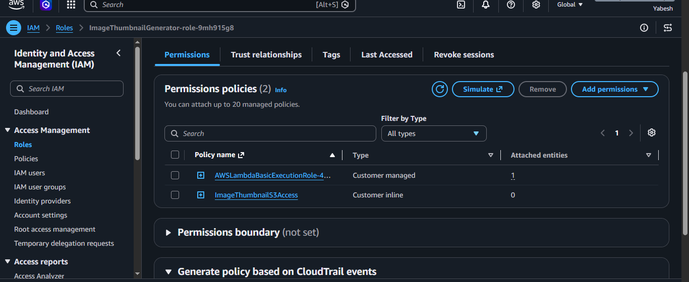
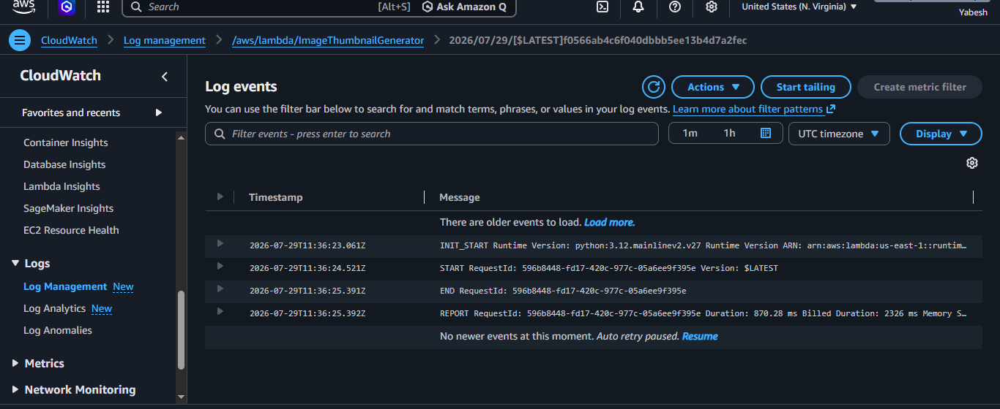
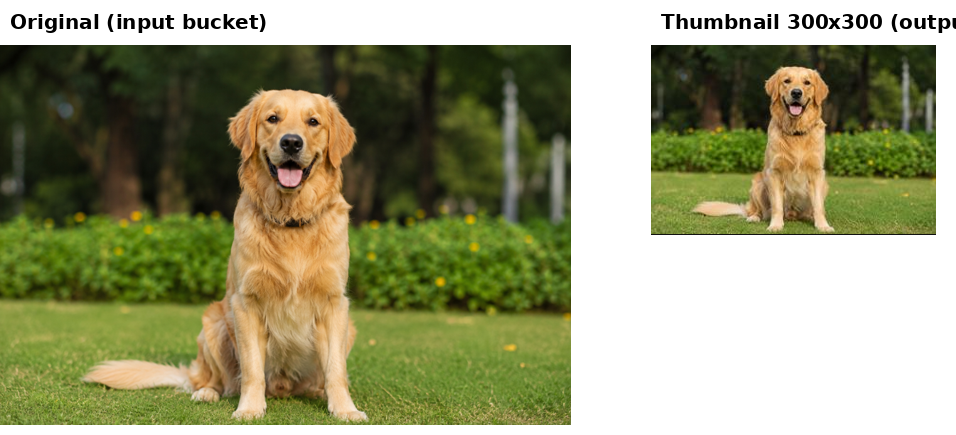

# AWS Serverless Image Thumbnail Generator

A complete **serverless image-processing web application built on AWS**.

Users can select an image directly from the browser, upload it to Amazon S3, and automatically generate an optimized thumbnail using AWS Lambda and Python/Pillow.

The generated thumbnail is displayed back on the website and can be downloaded directly from the browser.

The project demonstrates a complete browser-to-AWS serverless workflow using **Amazon S3, Amazon API Gateway, AWS Lambda, IAM, CloudWatch, Python, Pillow, HTML, CSS, and JavaScript**.

---

## Live Application

The completed web application allows users to:

- Choose an image from their device
- Preview the original image
- Upload the image securely to Amazon S3
- Automatically trigger serverless image processing
- Generate a thumbnail with a maximum size of **300×300 pixels**
- Display the generated thumbnail on the same webpage
- Download the generated thumbnail


### Application Workflow

```text
Choose Image
     ↓
Generate Thumbnail
     ↓
Upload to Amazon S3
     ↓
AWS Lambda Processing
     ↓
Thumbnail Stored in S3
     ↓
Thumbnail Displayed in Browser
     ↓
Download Thumbnail
```

---

## Features

- Serverless image-processing architecture
- Browser-based image upload
- Static website hosted using Amazon S3
- REST-style communication through Amazon API Gateway HTTP API
- Secure browser uploads using S3 presigned URLs
- Event-driven Lambda invocation using S3 events
- Automatic image resizing using Python and Pillow
- Maximum thumbnail size of **300×300 pixels**
- Original aspect ratio preserved
- Separate S3 buckets for original images and generated thumbnails
- Automatic thumbnail detection from the frontend
- Generated thumbnail displayed without manually refreshing the page
- Browser-based thumbnail download
- IAM-based access control
- Amazon CloudWatch logging and monitoring
- Responsive HTML/CSS/JavaScript frontend

---

## Architecture



### Architecture Flow

```text
                    USER / BROWSER
                          │
                          ▼
                 S3 Static Website
                 HTML + CSS + JS
                          │
                          ▼
                  Amazon API Gateway
                          │
                          ▼
               Upload API Lambda
                          │
                 Presigned S3 URL
                          │
                          ▼
                Source S3 Bucket
                          │
                 ObjectCreated Event
                          │
                          ▼
              Thumbnail Processor
                   AWS Lambda
                Python + Pillow
                          │
             ┌────────────┴────────────┐
             │                         │
             ▼                         ▼
      Destination S3             CloudWatch Logs
     thumbnails/*.jpg
             │
             ▼
       API Gateway / Lambda
             │
             ▼
     Browser Thumbnail Preview
             │
             ▼
          Download
```

---

## How It Works

### 1. Static Web Application

The frontend is built using:

- HTML
- CSS
- JavaScript

The website is hosted using **Amazon S3 Static Website Hosting**.

Users select an image through the browser and can immediately preview the original image before uploading it.

---

### 2. API Gateway

The frontend communicates with the backend through an **Amazon API Gateway HTTP API**.

API Gateway provides the public API endpoint used by the JavaScript frontend.



The API connects the browser application to the serverless Lambda backend without requiring a traditional web server.

---

### 3. Upload API Lambda

A dedicated Lambda function handles requests from the frontend.



The function generates a temporary **Amazon S3 presigned URL**.

This allows the browser to upload the selected image directly to the private source S3 bucket without exposing AWS credentials to the frontend.

Conceptually:

```text
Browser
   │
   │ Request upload URL
   ▼
API Gateway
   │
   ▼
Upload Lambda
   │
   │ Generate Presigned URL
   ▼
Browser
   │
   │ PUT Image
   ▼
Source S3 Bucket
```

---

### 4. Source S3 Bucket

The original image is uploaded to the source Amazon S3 bucket.

When the object is created, Amazon S3 automatically generates an:

```text
s3:ObjectCreated:*
```

event.

The event invokes the thumbnail-processing Lambda function.

---

### 5. Thumbnail Processing Lambda

The Lambda function retrieves the uploaded image from Amazon S3 and processes it using **Python and Pillow**.

The processing logic:

- Reads the S3 event
- Extracts the source bucket and object key
- Downloads the image using `s3:GetObject`
- Loads the image into memory
- Resizes it using Pillow
- Preserves the original aspect ratio
- Generates a thumbnail with a maximum size of **300×300 pixels**
- Converts the processed image to JPEG
- Uploads the result to the destination S3 bucket

The core resizing operation uses:

```python
image.thumbnail((300, 300))
```

Unlike forcing an image to exactly 300×300, Pillow's `thumbnail()` operation preserves the original aspect ratio while ensuring that neither dimension exceeds 300 pixels.

---

## Generated Thumbnail Structure

Generated thumbnails are stored under the `thumbnails/` prefix.

Example:

```text
thumbnails/<filename>-thumbnail.jpg
```

Example structure:

```text
Destination S3 Bucket
│
└── thumbnails/
    ├── image1-thumbnail.jpg
    ├── image2-thumbnail.jpg
    └── image3-thumbnail.jpg
```

---

## Automatic Thumbnail Display

After the original image is uploaded, the frontend waits for the event-driven Lambda processing to complete.

The application checks for the generated thumbnail and displays it automatically when it becomes available.

This creates the following asynchronous workflow:

```text
Upload Original
      ↓
S3 Event
      ↓
Lambda Processing
      ↓
Thumbnail Created
      ↓
Frontend Detects Result
      ↓
Thumbnail Displayed
```

The user does not need to manually open the destination S3 bucket or refresh the application.

---

## Thumbnail Download

After processing is complete, the generated thumbnail appears inside the **Generated Thumbnail** section of the application.

The user can then download the generated image directly from the browser.


This completes the full workflow:

```text
Upload → Process → Preview → Download
```

---

## Tech Stack

| Component | Technology / AWS Service |
|---|---|
| Frontend | HTML, CSS, JavaScript |
| Website Hosting | Amazon S3 Static Website Hosting |
| API Layer | Amazon API Gateway HTTP API |
| Upload Backend | AWS Lambda |
| Image Processing | AWS Lambda |
| Programming Language | Python |
| Image Library | Pillow |
| Object Storage | Amazon S3 |
| Secure Upload | S3 Presigned URLs |
| Event Trigger | S3 Event Notifications |
| Access Control | AWS IAM |
| Monitoring | Amazon CloudWatch |
| Architecture | Serverless / Event-Driven |
| Website Region | ap-south-2 (Hyderabad) |
| Image Processing S3 Resources | us-east-1 (N. Virginia) |

---

## Project Structure

```text
aws-serverless-thumbnail-generator/
│
├── frontend/
│   ├── index.html
│   ├── style.css
│   └── script.js
│
├── lambda/
│   ├── upload_api/
│   │   └── lambda_function.py
│   │
│   └── thumbnail_processor/
│       └── lambda_function.py
│
├── screenshots/
│   ├── architecture-diagram.png
│   ├── aws-thumbnail.jpg
│   ├── api-gateway.png
│   ├── upload-api-lambda.png
│   ├── s3-event-trigger-config.png
│   ├── lambda-function-code.png
│   ├── cloudwatch-logs.png
│   ├── iam-role-permissions.png
│   └── before-after-thumbnail.png
│
├── lambda_function.py
├── requirements.txt
├── .gitignore
└── README.md
```

---

## Frontend

The frontend is located inside:

```text
frontend/
```

It contains:

```text
index.html
style.css
script.js
```

### `index.html`

Defines the user interface including:

- Image selection
- Original image preview
- Generate Thumbnail button
- Generated thumbnail preview
- Download functionality
- Architecture flow display

### `style.css`

Provides the responsive UI styling for desktop and mobile devices.

### `script.js`

Handles the browser-side workflow including:

- Reading the selected image
- Displaying the original image preview
- Calling API Gateway
- Uploading the image through a presigned S3 URL
- Checking for the generated thumbnail
- Displaying the processed thumbnail
- Downloading the generated image

---

## Lambda Functions

The project contains two main Lambda responsibilities.

### Upload API Lambda

Location:

```text
lambda/upload_api/lambda_function.py
```

Responsibilities:

- Receive requests from API Gateway
- Generate unique S3 object keys
- Generate presigned upload URLs
- Return information required by the frontend
- Check whether generated thumbnails are available
- Provide access to generated results

### Thumbnail Processor Lambda

Location:

```text
lambda/thumbnail_processor/lambda_function.py
```

Responsibilities:

- Receive S3 `ObjectCreated` events
- Retrieve uploaded images
- Process images using Pillow
- Generate thumbnails
- Store processed images in the destination S3 bucket

---

## S3 Event-Driven Processing

The source S3 bucket is configured to invoke the thumbnail Lambda automatically whenever a new object is uploaded.



This removes the need for:

- Dedicated servers
- Background polling workers
- Manually starting the image-processing function

Amazon S3 acts as the event source and AWS Lambda performs the processing on demand.

---

## Lambda Processing Code

The thumbnail-generation function is implemented using Python.



The function processes images entirely in memory using Python `BytesIO`, reducing the need for temporary persistent storage.

The destination bucket can be provided to the Lambda function through:

```text
DESTINATION_BUCKET
```

This keeps environment-specific configuration separate from the application logic.

---

## IAM Permissions

IAM roles provide the Lambda functions with the AWS permissions required to perform their tasks.



Typical required permissions include:

```text
s3:GetObject
s3:PutObject
logs:CreateLogGroup
logs:CreateLogStream
logs:PutLogEvents
```

The upload API Lambda requires appropriate access to generate S3 operations for the source and destination objects.

The thumbnail processor requires permission to read original images and write generated thumbnails.

IAM permissions should follow the **principle of least privilege** and be scoped to only the required resources and actions.

---

## CloudWatch Monitoring

AWS Lambda automatically integrates with Amazon CloudWatch for execution logging.



CloudWatch was used to:

- Verify Lambda invocations
- Confirm successful execution
- Inspect processing errors
- Troubleshoot S3 and Lambda integration
- Monitor the event-driven workflow

---

## Original vs Generated Thumbnail

The image-processing result can also be verified by comparing the original image with the generated output.



The thumbnail remains proportional to the original image because the processing logic preserves its aspect ratio.

---

## Deployment Process

The project was implemented using the following workflow:

1. Created separate Amazon S3 buckets for original images and generated thumbnails.
2. Created the image-processing AWS Lambda function.
3. Added Pillow support to the Lambda environment.
4. Configured the destination S3 bucket.
5. Added the required IAM permissions.
6. Configured the S3 `ObjectCreated` event notification.
7. Connected the source S3 bucket to the thumbnail processor Lambda.
8. Tested automatic thumbnail generation using direct S3 uploads.
9. Created an S3 bucket for the static web application.
10. Enabled S3 Static Website Hosting.
11. Developed the HTML, CSS, and JavaScript frontend.
12. Created the upload API Lambda.
13. Created the Amazon API Gateway HTTP API.
14. Connected the frontend to API Gateway.
15. Implemented presigned S3 uploads.
16. Configured the required CORS settings.
17. Implemented automatic checking for generated thumbnails.
18. Added browser-based original image preview.
19. Added generated thumbnail preview.
20. Added direct thumbnail download functionality.
21. Tested the complete browser-to-AWS workflow.

---

## Security Design

The architecture avoids placing AWS credentials inside frontend JavaScript.

Instead, the browser obtains temporary presigned URLs from the serverless backend.

```text
Browser
   ↓
API Gateway
   ↓
Lambda
   ↓
Temporary Presigned URL
   ↓
Direct S3 Operation
```

This allows the application to interact with private S3 resources without exposing permanent IAM access keys.

Additional security practices used in the architecture include:

- IAM execution roles
- Least-privilege permissions
- Private source and destination image buckets
- CORS configuration
- Temporary presigned URLs
- Separation between website hosting and image-storage buckets

---

## Serverless Design

The application does not require EC2 instances or a continuously running application server.

The major components are managed AWS services:

```text
Amazon S3
Amazon API Gateway
AWS Lambda
Amazon CloudWatch
AWS IAM
```

Lambda executes only when required, while S3 provides both object storage and static website hosting.

This demonstrates a lightweight event-driven serverless architecture.

---

## What I Learned

Through this project, I gained hands-on experience with:

- Building a complete serverless application on AWS
- Creating event-driven architectures
- Integrating Amazon S3 with AWS Lambda
- Building HTTP APIs using Amazon API Gateway
- Connecting a JavaScript frontend to AWS services
- Generating and using Amazon S3 presigned URLs
- Configuring S3 CORS
- Hosting static websites using Amazon S3
- Processing images using Python and Pillow
- Working with Lambda Layers and dependencies
- Managing Lambda environment configuration
- Creating IAM permissions for service-to-service communication
- Using CloudWatch Logs for troubleshooting
- Handling asynchronous serverless workflows
- Working with S3 object keys and event payloads
- Building browser upload and download functionality
- Debugging API Gateway, Lambda, S3, and browser integration

---

## Key AWS Concepts Demonstrated

`Amazon S3` • `AWS Lambda` • `Amazon API Gateway` • `AWS IAM` • `Amazon CloudWatch` • `S3 Presigned URLs` • `S3 Static Website Hosting` • `S3 Event Notifications` • `Lambda Layers` • `CORS` • `Event-Driven Architecture` • `Serverless Computing`

---

## Project Result

The final application provides an end-to-end serverless workflow:

```text
User
 ↓
Web Application
 ↓
API Gateway
 ↓
Lambda
 ↓
Presigned S3 Upload
 ↓
Source S3
 ↓
S3 Event
 ↓
Thumbnail Lambda
 ↓
Destination S3
 ↓
Generated Thumbnail
 ↓
Browser Preview
 ↓
Download
```

The project started as a simple S3-triggered Lambda image processor and was extended into a functional browser-based serverless application.

It demonstrates both the underlying AWS infrastructure and a working user-facing application built entirely around managed AWS services.
